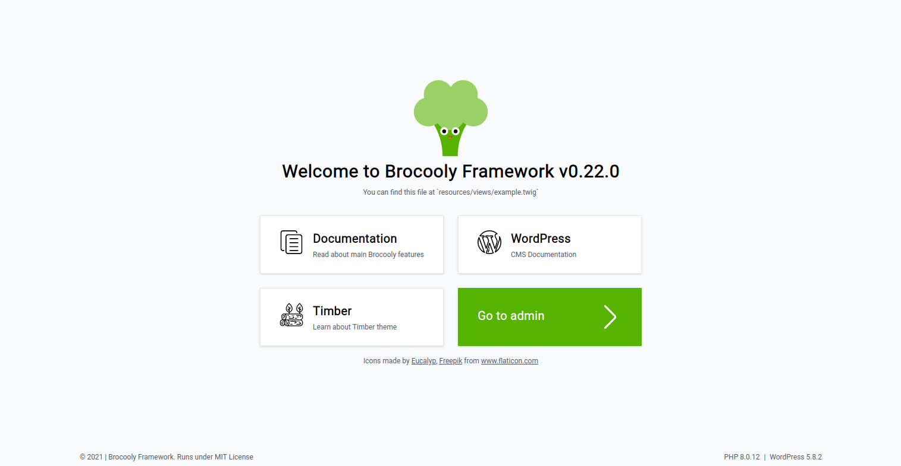
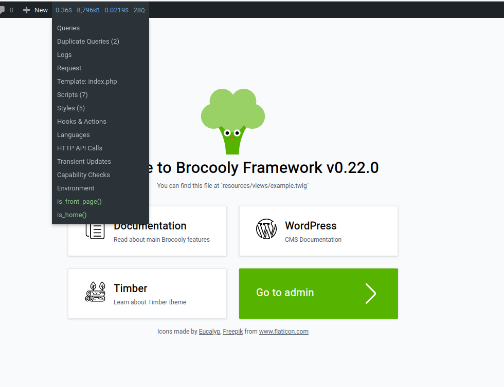
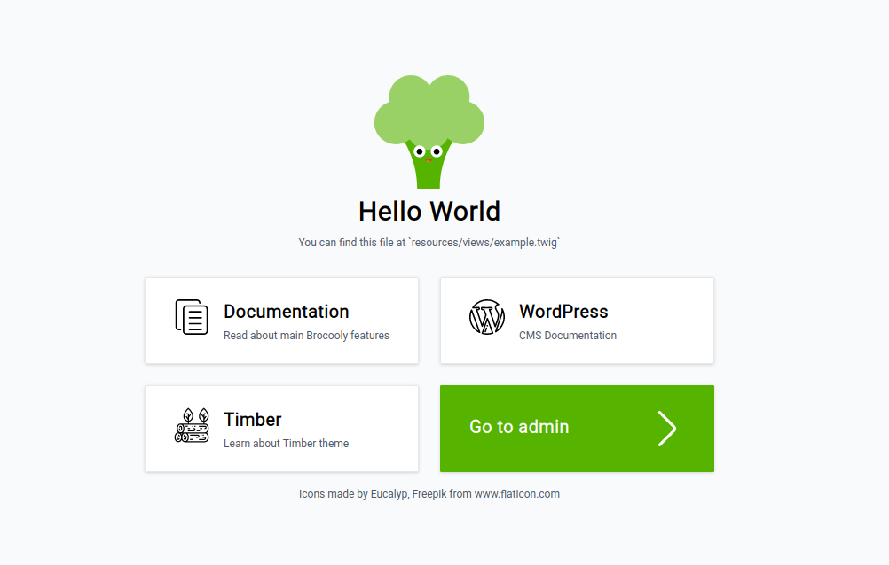

# Views

?> Brocooly uses twig - so feel free to check its [official documentation](https://twig.symfony.com/doc/3.x/)

So far we talked about how to direct users into certain page with its content but didn't mentioned where they are located and what they are. Default WordPress mixing all within `.php` files - queries, helper functions, HTML-code - all inside appropriate templates. You have to open `<?php`, close `?>`, again open and close and so on. PHP itself if HTML pre-formatter but it's much more convinient to work within HTML templates and do not mix it with PHP backend code. This is where template engines are coming handy like Laravel blade, Twig, Latte, etc. Brocooly strongly depends on Timber Framework - it is basically its core - so by default it uses twig and I personally like it. So instead of using mixed PHP-files all our logic behind the scene may be placed within Contoller and Models, while twig-templates (or views) will simply introduce front-end to all users.

All view files are located within `resources/views` folder inside theme but it may be changed as you wish.

## Starter screen

On a first run you will see this screen:



You will notice small line just after 'Welcome to Brocooly' title mentioned 'You can find this file at resources/views/example.twig'. That is true - if you look at it, you will find all icons, test and some more.

At the top you will see

```twig
<h1 class="mb-2 text-3xl font-semibold text-center">
	{{ hello }}
</h1>
```

What does `{{ hello }}` means and where did it came from? Let's find out.

First of all let's take a look at `routes/web.php`. We know, we're currently on front page of application

?> You may check current page with [Query Monitor plugin](https://querymonitor.com/) installed with Brocooly itself. All you need to do - is to login into admin area and activate it. You may activate all plugins with `wp plugin activate --all` but you still required to be authorized to see admin navbar. As you can see, it is `is_front_page()` and `is_home()`.



```php
Route::isFrontPage( FrontPageController::class );
```

This line is exactly what we're looking for - its condition `is_front_page` and as a callback it is invokable class `FrontPageController` located at `src/Containers/FrontPageSection/Web/Controllers`. Let's open it.

```php
namespace Theme\Containers\FrontPageSection\Web\Controllers;

use Theme\Http\Controllers\Controller;
use Theme\Containers\FrontPageSection\Contracts\Actions\GetMainScreenActionContract;

class FrontPageController extends Controller
{

	private $mainScreen;

	public function __construct( GetMainScreenActionContract $mainScreen ) {
		$this->mainScreen = $mainScreen;
	}

	public function __invoke() {
		$hello = $this->mainScreen->getHelloWorld();
		return view( 'content/front-page.twig', compact( 'hello' ) );
	}
}
```

This is where the views magic begins. You can see we're rendering `content/front-page.twig` file with `hello` variable. Let's change a little.

```php
public function __invoke() {
	$hello = 'Hello World';
	return view( 'content/front-page.twig', compact( 'hello' ) );
}
```



As you can see 'Hello World' is now on front page. You can pass ANY data into view file from your controller using any logic.

## Params

Anytime you need to render view template, use `view()` method. Which is actually may accept 2 params.

| Param | Accepts | Definition |
| ------ | ------ | ------ |
| $template | string\|array | Template name or array of templates to render. IF ypu pass an array, the first found will be loaded |
| $data | array\|null | Data inside template. By default it will merged with Timber default context and global context defined inside `src/Http/Brocooly.php` `context()` method  |

If for some reason you pass incorrect template name or just forgot to do it Brocooly will load default page defined within `config/views.php` file as `default` param.

### Default Context

Timber stores next default context which will be available in every template. Unless you specified twig's `only` within ``

| Data | Condition | Definition |
| ------ | ------ | ------ |
| http_host | globally |  |
| wp_title | globally | site title |
| body_class | globally | body classes |
| site | globally | site information |
| request | globally | GET and POST request data |
| user | if user authorized - otherwise will return `false` | current user object |
| theme | globally | theme object |
| posts | globally | default PostQuery |